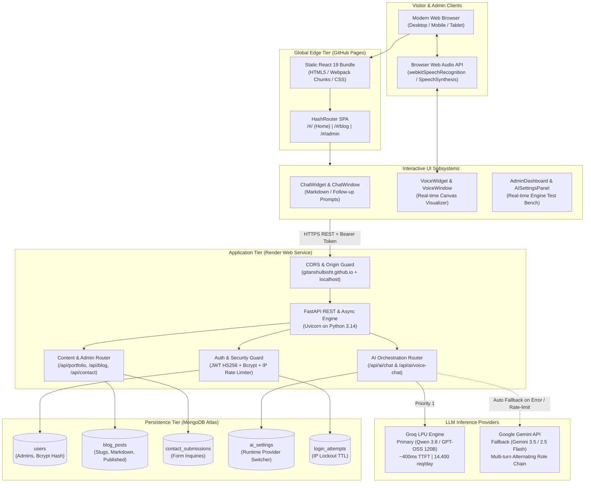

# Anshul Bisht — AWS Cloud DevOps & SRE Portfolio

[](https://gitanshulbisht.github.io/portfolio/)
[](https://devops-react-render-portfolio.onrender.com/docs)
[](LICENSE)
[](#testing--verification)

> Production-grade, full-stack portfolio & developer platform for **Anshul Bisht** (Senior AWS Cloud DevOps & SRE Engineer with 7+ years of experience). Featuring interactive multi-model AI assistants, a real-time reactive Voice AI HUD, blog CMS, secure administrative dashboard, and modern terminal-aesthetic UI.

---

## 📑 Table of Contents

- [Architecture Overview](#-architecture-overview)
- [Key Features](#-key-features)
  - [1. Interactive AI Assistant Suite](#1-interactive-ai-assistant-suite)
  - [2. Terminal & Cloud Architecture UI](#2-terminal--cloud-architecture-ui)
  - [3. Full-Featured Technical Blog](#3-full-featured-technical-blog)
  - [4. Secure Admin Control Center](#4-secure-admin-control-center)
  - [5. DevSecOps & Security Hardening](#5-devsecops--security-hardening)
- [Technology Stack](#-technology-stack)
- [System Architecture Diagram](#-system-architecture-diagram)
- [Subsystem Breakdown](#-subsystem-breakdown)
- [API Reference](#-api-reference)
- [Local Development Setup](#-local-development-setup)
- [Environment Configuration](#-environment-configuration)
- [Deployment Guide](#-deployment-guide)
  - [Frontend (GitHub Pages)](#frontend-github-pages)
  - [Backend (Render Blueprint)](#backend-render)
- [Testing & Verification](#-testing--verification)
- [Security & Public Repository Compliance](#-security--public-repository-compliance)

---

## 🏗 Architecture Overview

The system is decoupled into two primary tiers designed for zero-maintenance hosting, speed, and continuous availability:

1. **Frontend Client (GitHub Pages)**:
   - Built on **React 19**, **Tailwind CSS**, and **Framer Motion**.
   - Hosted globally on GitHub's multi-region CDN via GitHub Pages.
   - Utilizes `HashRouter` for zero-configuration client-side routing on static hosting (avoiding SPA 404s on page refresh).
   - Non-blocking self-hosted fonts (`IBM Plex Sans`, `JetBrains Mono`, `Outfit`), deferred analytics, and route-level code splitting (`React.lazy`).

2. **Backend Services (Render Web Service)**:
   - High-performance asynchronous API engine powered by **Python 3.14** and **FastAPI**.
   - Backed by **MongoDB Atlas** for document persistence (blog articles, contact messages, portfolio data, AI settings).
   - Dual-engine AI inference layer supporting **Groq LPU** (Qwen 3.8 / GPT-OSS 120B) for sub-second latency and **Google Gemini** (Gemini 2.5/3.5 Flash) with automated failover and role-turn coalescing.
   - Dual-layer authentication with bcrypt-hashed credentials, JWT access & refresh tokens, cross-origin Bearer headers, and brute-force IP rate-limiting.

---

## 📊 System Architecture Diagram



---

## ⚡ Key Features

### 1. Interactive AI Assistant Suite
- **Text Chatbot Assistant (`frontend/src/components/chat/`)**:
  - Embedded AI assistant grounded in Anshul's verified 7+ years of experience in AWS, Kubernetes, Terraform, Argo CD, and CI/CD pipelines.
  - Interactive suggested follow-up chips for instant single-click inquiry exploration.
  - Full Markdown rendering with resilient network retry handling for Render free-tier cold starts.
- **Voice AI Assistant HUD (`frontend/src/components/voice/`)**:
  - Hands-free, spoken two-way conversation directly inside the browser.
  - Live Speech-to-Text (`webkitSpeechRecognition` / `SpeechRecognition`) and Speech-to-Text response via Web SpeechSynthesis API.
  - **Single Premium Voice Lock**: Programmatically locks onto the highest-quality human natural voice on the client OS, eliminating jarring mid-session voice swaps.
  - **Live Audio Frequency Visualizer**: Canvas-based, reactive sine wave reacting to actual microphone frequency levels and assistant speech state (`idle`, `listening`, `thinking`, `speaking`).
- **Dynamic AI Provider Switching (Admin Bench)**:
  - Supports dynamic switching between **Groq LPU** (sub-second high-speed inference), **Google Gemini** (structured deep reasoning), or **Auto** (Groq primary with instant Gemini fallback).
  - Built-in live latency and round-trip benchmark tool in the Admin panel.

### 2. Terminal & Cloud Architecture UI
- **Cyberpunk / Terminal Aesthetics**: Monospace accenting (`JetBrains Mono`), dark carbon surfaces (`#030303`), cyan HUD telemetry borders, and custom reactive mouse cursors with dot-trail physics.
- **Bento Grid Cloud Experience**: Interactive cards detailing production metrics, cloud cost optimizations (~20% savings), AWS architectural blueprints, and certifications.
- **Performance Optimized**: Sub-second First Contentful Paint (FCP) achieved by self-hosting `.woff2` font files, deferring non-critical scripts, and pre-rendering above-the-fold content.

### 3. Full-Featured Technical Blog
- **Markdown & Slug Routing**: Public blog engine with tag filtering, cover image support, and clean URL slugs.
- **Single Page Application Resilience**: Client-side `HashRouter` navigation allows users to bookmark or share direct links (`/#/blog/designing-ha-eks-clusters`) without static host 404 errors.

### 4. Secure Admin Control Center
- **JWT & Cookie Hybrid Authentication**: Access tokens sent via secure HTTP cookies and cross-origin Authorization Bearer headers.
- **Brute Force Protection**: IP-based lockout mechanism preventing dictionary attacks on the admin login endpoint.
- **Live Portfolio Content Editor**: Update personal taglines, skills, stats, and employment history without redeploying code.
- **Contact Submission Inbox**: Real-time management and status tracking of inquiries received through the portfolio contact form.

### 5. DevSecOps & Security Hardening
- **Zero Secrets in Git**: Strict `.gitignore` policy auditing `.env`, credentials, SSH keys, and tokens. Full git history scanned for leak signatures.
- **Strict CORS Safeguards**: Dynamic origin whitelist allowing production GitHub Pages domain (`https://gitanshulbisht.github.io`) and local developer origins.
- **Render Infrastructure-as-Code Blueprint**: Declarative `render.yaml` configuration with `sync: false` for all production keys.

---

## 💻 Technology Stack

| Layer | Technologies |
|---|---|
| **Frontend Framework** | React 19, React Router DOM 7 (`HashRouter`), CRACO |
| **Styling & UI** | Tailwind CSS 3, Framer Motion 13, Lucide React, Sonner Toasts |
| **Audio & Speech** | Web Audio API (`AnalyserNode`), Web Speech Recognition, Web SpeechSynthesis |
| **Backend Framework** | FastAPI 0.115+, Starlette, Pydantic v2, Uvicorn |
| **Runtime & Language** | Python 3.14, Node.js 20+ / Yarn |
| **Database** | MongoDB Atlas (via Motor async driver) |
| **AI Inference** | Groq API (`qwen/qwen3.8-27b`, `openai/gpt-oss-120b`), Google Generative AI (`gemini-3.5-flash-lite`, `gemini-2.5-flash-lite`) |
| **Testing** | Pytest, Pytest-AsyncIO, Requests, Jest |
| **Hosting & CI/CD** | GitHub Pages (Frontend CDN), Render (Backend Container), GitHub Actions |

---

## 📁 Subsystem Breakdown

```
portfolio/
├── .github/                      # GitHub configurations & issue templates
├── backend/                      # FastAPI Python Application
│   ├── tests/                    # Integration & unit test suites
│   │   ├── backend_test.py       # Full-stack API integration test
│   │   ├── test_ai_assistant.py  # Mocked Gemini & Groq router tests
│   │   └── test_server_auth.py   # Bcrypt, JWT, and lockout unit tests
│   ├── ai_assistant.py           # Dual-engine AI router (Groq & Gemini logic)
│   ├── ai_context.py             # Grounding knowledge base & system instructions
│   ├── requirements.txt          # Python dependencies
│   ├── runtime.txt               # Render Python version declaration
│   ├── server.py                 # Core FastAPI app, routes, auth, and database hooks
│   └── .env.example              # Environment variables template
├── docs/                         # Architecture documentation & design specifications
├── frontend/                     # React 19 Single Page Application
│   ├── public/                   # Static assets, self-hosted fonts, index.html
│   │   └── fonts/                # Self-hosted woff2 files (IBMPlexSans, JetBrainsMono, Outfit)
│   ├── src/
│   │   ├── components/
│   │   │   ├── admin/            # AISettingsPanel, PortfolioEditor
│   │   │   ├── chat/             # ChatWidget, ChatWindow, chatService.js
│   │   │   ├── sections/         # Hero, About, Projects, Experience, Skills, Certs, Contact
│   │   │   ├── voice/            # VoiceWidget, VoiceWindow, VoiceVisualizer, voiceService.js
│   │   │   └── Navbar.jsx / Footer.jsx
│   │   ├── contexts/             # AuthContext (JWT management & session state)
│   │   ├── lib/                  # api.js (Axios client with Bearer interceptors)
│   │   ├── pages/                # Home, BlogList, BlogDetail, AdminLogin, AdminDashboard
│   │   ├── App.js                # Root router & non-invasive widget mount
│   │   └── index.css             # Tailwind base, dark prose, keyframes, cyber accents
│   ├── package.json              # Dependencies & build scripts (gh-pages)
│   └── .env.example              # Frontend environment template
├── auth_testing.md               # Playbook for local authentication verification
├── render.yaml                   # Infrastructure-as-Code Blueprint for Render deployment
└── README.md                     # Comprehensive technical documentation
```

---

## 🔌 API Reference

### Public Endpoints

| Method | Route | Description | Auth Required |
|---|---|---|---|
| `GET` | `/api/portfolio` | Fetch active portfolio configuration, profile, and stats | No |
| `GET` | `/api/blog` | List all published blog articles (supports `?published_only=true`) | No |
| `GET` | `/api/blog/{slug}` | Fetch single blog article by URL slug | No |
| `POST` | `/api/contact` | Submit inquiry from contact form | No |
| `POST` | `/api/ai/chat` | Send conversational turn to AI text assistant | No |
| `POST` | `/api/ai/voice-chat`| Send voice transcript turn to AI assistant (concise reply) | No |

### Authentication & Admin Endpoints

| Method | Route | Description | Auth Required |
|---|---|---|---|
| `POST` | `/api/auth/login` | Authenticate admin, returns JWT & sets session cookies | No (Rate-limited) |
| `POST` | `/api/auth/logout` | Clear session cookies | Yes |
| `GET` | `/api/auth/me` | Fetch authenticated admin profile | Yes |
| `POST` | `/api/auth/refresh` | Refresh access token using refresh token | Yes |
| `GET` | `/api/admin/contacts` | List all incoming contact submissions | Yes |
| `PATCH`| `/api/admin/contacts/{id}/read` | Mark message as read | Yes |
| `DELETE`| `/api/admin/contacts/{id}` | Delete contact submission | Yes |
| `GET` | `/api/admin/blog` | List all articles (including drafts) | Yes |
| `POST` | `/api/admin/blog` | Create new blog article (auto slug generation) | Yes |
| `PUT` | `/api/admin/blog/{id}` | Update existing blog article | Yes |
| `DELETE`| `/api/admin/blog/{id}` | Remove blog article | Yes |
| `GET` | `/api/admin/ai-settings` | Inspect active AI engine and API key statuses | Yes |
| `PUT` | `/api/admin/ai-settings` | Switch active engine (`auto`, `groq`, `gemini`) | Yes |

---

## 🛠 Local Development Setup

### Prerequisites
- **Node.js** >= 18.x and **Yarn**
- **Python** >= 3.11 (Python 3.14 recommended)
- **MongoDB** local instance or a free [MongoDB Atlas Cluster](https://www.mongodb.com/cloud/atlas)

### 1. Clone the Repository
```bash
git clone https://github.com/gitanshulbisht/portfolio.git
cd portfolio
```

### 2. Backend Setup
```bash
# Create and activate Python virtual environment
python3 -m venv .venv
source .venv/bin/activate

# Install dependencies
pip install -r backend/requirements.txt

# Configure environment
cp backend/.env.example backend/.env
# Edit backend/.env with your MONGO_URL, JWT_SECRET, and API keys
```

Start the FastAPI development server:
```bash
uvicorn backend.server:app --host 127.0.0.1 --port 8001 --reload
```
Swagger UI will be live at `http://127.0.0.1:8001/docs`.

### 3. Frontend Setup
```bash
cd frontend

# Install dependencies
yarn install

# Configure environment
cp .env.example .env
# Set REACT_APP_BACKEND_URL=http://127.0.0.1:8001

# Start React development server
yarn start
```
The application will launch at `http://localhost:3000`.

---

## ⚙ Environment Configuration

### Backend (`backend/.env`)

```env
# Database & Core
MONGO_URL=mongodb+srv://<username>:<password>@<cluster>.mongodb.net/?retryWrites=true&w=majority
DB_NAME=portfolio_db
JWT_SECRET=generate_a_cryptographically_secure_random_string
ENVIRONMENT=development
FRONTEND_URL=http://localhost:3000,https://gitanshulbisht.github.io

# Admin Seeding
ADMIN_EMAIL=admin@anshulbisht.dev
ADMIN_PASSWORD=SetAStrongPasswordHere

# LLM Providers (Optional for local UI preview; required for live AI responses)
GROQ_API_KEY=gsk_...
GEMINI_API_KEY=AIza...
DEFAULT_AI_PROVIDER=auto
```

### Frontend (`frontend/.env`)

```env
REACT_APP_BACKEND_URL=https://devops-react-render-portfolio.onrender.com
```

---

## 🚀 Deployment Guide

### Frontend (GitHub Pages)

The repository is configured with `gh-pages` tooling:

1. Verify `homepage` in `frontend/package.json`:
   ```json
   "homepage": "https://gitanshulbisht.github.io/portfolio/"
   ```
2. Build and deploy to GitHub Pages:
   ```bash
   cd frontend
   yarn deploy
   ```
   *This automatically builds the production React application and pushes the compiled assets to the `gh-pages` branch.*

3. In your GitHub repository settings under **Pages**, set the source branch to `gh-pages` and folder to `/(root)`.

### Backend (Render)

The project includes an automated Infrastructure-as-Code blueprint in `render.yaml`:

1. Log into your [Render Dashboard](https://dashboard.render.com).
2. Click **New +** &rarr; **Blueprint**.
3. Connect `gitanshulbisht/portfolio` and Render will parse `render.yaml`.
4. Supply your secret environment variables in the Render prompt (`MONGO_URL`, `ADMIN_EMAIL`, `ADMIN_PASSWORD`, `GEMINI_API_KEY`, `GROQ_API_KEY`).
5. Render will provision the container, execute `pip install`, and launch Uvicorn with zero downtime.

---

## 🧪 Testing & Verification

Comprehensive test suites are included across the application:

```bash
# Activate virtual environment
source .venv/bin/activate

# Run backend unit tests (Password hashing, JWT, AI system prompt contracts)
pytest backend/tests/test_server_auth.py backend/tests/test_ai_assistant.py -v

# Run integration tests against a running backend
REACT_APP_BACKEND_URL=http://127.0.0.1:8001 pytest backend/tests/backend_test.py -v

# Run frontend production build verification
cd frontend
yarn build
```

---

## 🔒 Security & Public Repository Compliance

This repository strictly complies with modern DevSecOps standards for open-source and public repositories:

1. **No Credentials or Keys in Version Control**:
   - Automated git history regex scans ensure no MongoDB connection strings, API keys, or private SSH keys exist in any commit.
2. **Environment Variable Decoupling**:
   - Production secrets are injected purely at container runtime via Render environment configuration.
3. **CORS Isolation**:
   - Only authorized origins (`https://gitanshulbisht.github.io` and developer localhosts) can execute requests against protected endpoints.
4. **Bcrypt + JWT Defense**:
   - Admin credentials are stored using bcrypt with work-factor salting. All admin routes require a verified JWT bearer token or HTTP-only cookie.
5. **Rate Limiting & Lockout**:
   - Repeated failed login attempts trigger an IP-based lockout to mitigate automated credential attacks.

---

## 👤 Author

**Anshul Bisht**
- **Role**: AWS Cloud DevOps & SRE Engineer
- **GitHub**: [@gitanshulbisht](https://github.com/gitanshulbisht)
- **Portfolio**: [https://gitanshulbisht.github.io/portfolio/](https://gitanshulbisht.github.io/portfolio/)
- **Email**: [anshul123bisht@gmail.com](mailto:anshul123bisht@gmail.com)

---

## 📄 License

This project is licensed under the MIT License — see the [LICENSE](LICENSE) file for details.
